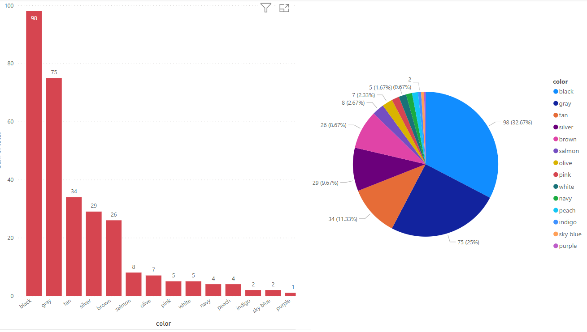
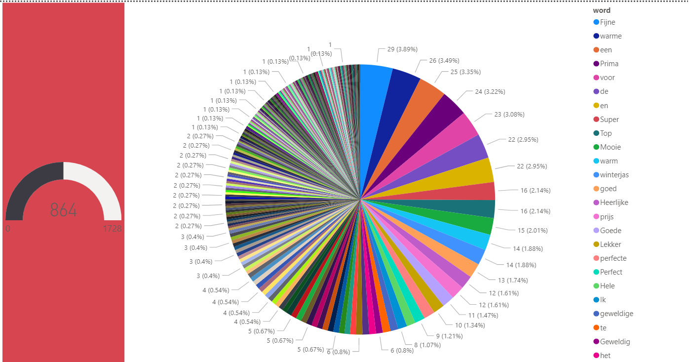
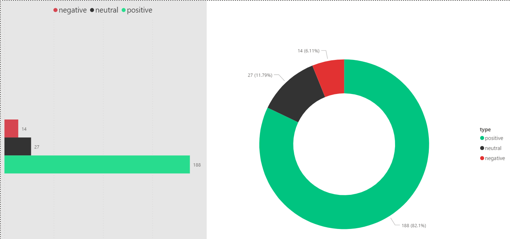

# Project Name

    - This project is a data analysis tool that includes several scripts to analyze images and text data and store results in a Microsoft Access database.
    - While the project was completed in under 10 hours due to time constraints, there may be opportunities to further optimize the code for better performance and functionality.
    - As a diligent student at The Hague University of Applied Sciences, I am also a proficient software engineer with experience overseeing large-scale programming projects across diverse industries. In addition to my studies, I research and explore innovative ways to teach programming and design to students of all levels. You can find me online under the name "Coder Shiyar"

## Installation

Clone this repository to your local machine using `https://github.com/codershiyar/data_analyse`.

The following libraries are required to run this project:
- `extcolors`:A library used to extract the most common colors in an image.
- `os`: A library used for interacting with the operating system, such as accessing files and directories.
- `collections`: A library used for handling collections of data, such as counting occurrences of items in a list or dictionary.
- `pyodbc`:A library used for connecting to and interacting with databases using SQL commands.
- `concurrent.futures`: A library used for running tasks asynchronously and in parallel.
- `math`: A library used for mathematical operations and functions.
- `csv`: A library used for reading and writing CSV files.
- `re`: A library used for working with regular expressions to search and manipulate text.
- `json`: A library used for reading and writing JSON files.
- `matplotlib.pyplot as plt`: A library used for creating visualizations and plots in Python.

## Usage

This project includes several scripts to analyze data and store results in a Microsoft Access database. Here is a brief description of each script:

- `database.py` allows you to interact with an access database using SQL commands.
- `images_analyse.py` analyzes images and returns the most used colors in pictures.
- `popular_words.py` analyzes texts to get popular words and saves the results to the database.
- `sentiment_analyse.py` analyzes customer sentiment by their reviews and saves the results to the database.

The `data` folder contains a CSV file which contains image filenames and text data for analysis.

Additionally, the `PowerBI` folder contains a Power BI project that is connected to the database and includes several dashboards with analysis results.

To run any of the scripts, simply run `python script_name.py` in your terminal.

## Web content scraper
- If you need to gather and analyze data such as photos or videos, this project provides a helpful solution: `https://github.com/codershiyar/web-content-scraper`
